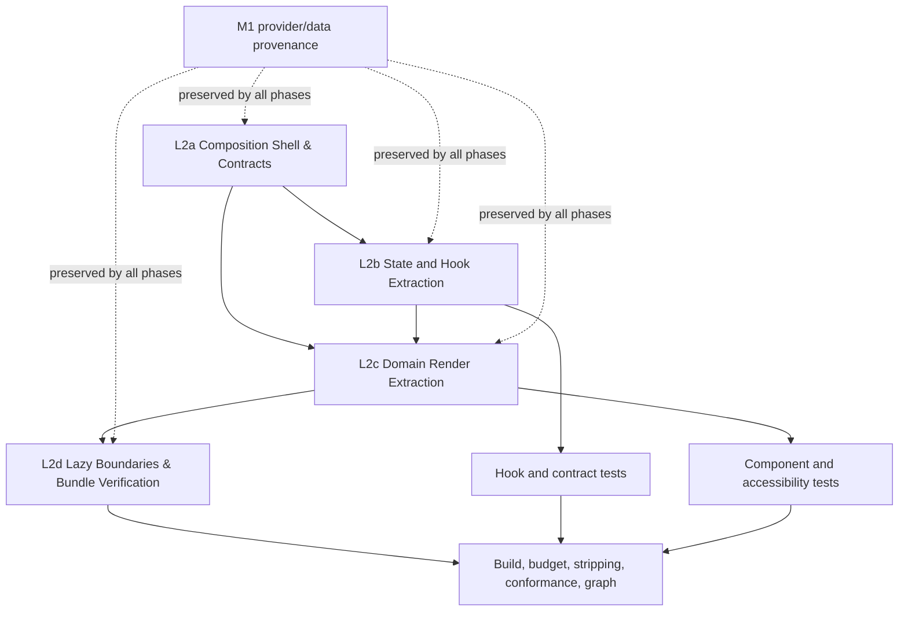

# Playbook فاز ۱۰: L2 — ClinicalDashboard Refactor

> وضعیت: فازبندی شده · دامنه: تحلیل و برنامه‌ریزی · اجرا: شروع نشده
>
> **قید اجرایی این سند:** این playbook فقط برنامه‌ریزی است. در زمان تهیه‌ی آن هیچ کد، build، test یا فایل source تغییر داده نشده است.

## ۱. Context

L2 به بازطراحی ساختاری `ClinicalDashboard` اختصاص دارد. هدف آن کاهش بدهی معماری در composition root داشبورد، بدون تغییر در رفتار بالینی، قرارداد providerهای M1، provenance داده، watermark دمو یا مسیرهای احراز هویت است.

در وضعیت فعلی، `apps/web/src/components/ClinicalDashboard.tsx` یک فایل **۱٬۶۶۲ خطی** است. این فایل هم‌زمان navigation و scroll orchestration، state داده‌ی بیمار، آپلود و lightbox تصویر، تحلیل هوش مصنوعی، چند modal بالینی، render سه بخش داشبورد و lazy boundary مدل سه‌بعدی را مدیریت می‌کند. این تمرکز مسئولیت‌ها هزینه‌ی تست، review، code ownership و تغییرات آینده را افزایش می‌دهد.

این refactor باید با اصل زیر اجرا شود:

> **ClinicalDashboard باید به یک composition shell کوچک تبدیل شود؛ domain behavior باید در component، hook و contractهای مستقل قرار گیرد.**

L2 نباید به بازنویسی UI/UX، تغییر provider contractهای M1، تغییر API بالینی، جابه‌جایی داده‌ی production یا اصلاح محتوای ترجمه تبدیل شود. تغییرات visual فقط در حد استخراج tokenها و حفظ pixel behavior مجاز است.

## ۲. Current State Analysis

### ۲.۱ شاخص‌های ایستای فایل هدف

| Metric | Current value | Interpretation |
|---|---:|---|
| Lines of code | 1,662 | Composition root بیش از حد بزرگ است. |
| Top-level imports | 32 | فایل به componentها، API، sync، i18n، engine و data contracts وابستگی مستقیم دارد. |
| `useState` calls | 5 syntactic call sites | چند state object بزرگ، از جمله state بیمار، تصاویر، lightbox و تحلیل را در یک scope نگه می‌دارند. |
| `useEffect` calls | 2 | scroll orchestration و lifecycleهای وابسته در root باقی مانده‌اند. |
| `useMemo` calls | 0 | محاسبات و derived view data هنوز مرز مشخصی ندارند. |
| `useRef` calls | 1 syntactic call site | بخشی از interaction state مستقیماً در root مدیریت می‌شود. |
| Dashboard sections | 3 explicit `<section>` boundaries | Patients، Gallery/Trichoscopy و 3D/Analytics در یک render tree قرار دارند. |
| Modal surfaces | 7 imported modal components plus inline Add Patient and Lightbox surfaces | modal ownership و payload state در root پخش شده است. |
| Lazy boundaries | 1 | فقط `LuxuryScalp3D` با `React.lazy` جدا شده است. |
| Data boundary | M1 provider prop with real-empty default | این قرارداد باید در تمام مراحل حفظ شود. |

این شمارش‌ها **تحلیل متنی source** هستند و معیار acceptance نیستند؛ معیار اصلی، قراردادهای خروجی، behavior tests، typecheck و build graph خواهد بود.

### ۲.۲ وابستگی‌ها و import surface

در ابتدای فایل، dashboard مستقیماً به دسته‌های زیر وابسته است:

| Dependency domain | Current examples | L2 concern |
|---|---|---|
| Platform/runtime | React hooks، `react-i18next`، React Query، Lucide | در composition root با domain behavior مخلوط شده‌اند. |
| Clinical/API | `apiFetch`، token logout، analysis engine | باید در hook یا adapterهای domain-owned محصور شوند. |
| Offline/sync | `useSync` | sync state نباید با render state تصویر و modal قاطی باشد. |
| Data | `Patient`، `TrichoscopyImage`، `DashboardDataProvider` | typeها اکنون جدا شده‌اند؛ L2 فقط باید مصرف آن‌ها را تمیزتر کند. |
| Presentation | Header، Tabs، sections، charts، modalها | بخشی استخراج شده، اما orchestration و payload هنوز در root است. |
| Heavy runtime | `LuxuryScalp3D` و Three.js lazy boundary | باید lazy boundary و fallback آن پایدار بماند. |

### ۲.۳ State و hook responsibilities

مسئولیت‌های state فعلی را می‌توان به پنج domain تقسیم کرد:

1. **Navigation state:** active section، scroll lock و back-to-top behavior.
2. **Clinical record state:** selected patient، local patients و local images.
3. **Analysis state:** selected area، AI result، detections و analysis callbacks.
4. **Media interaction state:** upload feedback، drag state، lightbox zoom/pan/rotation، caliper و photo notes.
5. **Modal/payload state:** consent، license، sync، education، guided capture، PDF، before/after و add-patient flows.

`useDashboardModals` از قبل یک seam مناسب برای visibility state ایجاد کرده است. L2 نباید reducer جدیدی را صرفاً برای جایگزینی آن ایجاد کند؛ باید فقط payload و domain side effect را از root خارج کند.

### ۲.۴ Render paths

درخت فعلی تقریباً چنین تقسیم می‌شود:

| Render domain | Current responsibility | Target owner |
|---|---|---|
| Header/navigation | header، sync/license/education actions، desktop/mobile tabs | `DashboardShell` + `DashboardHeader`/`DashboardTabs` |
| Patients | patient selection، add patient trigger، empty state | `PatientsSection` یا facade فعلی `PatientListSection` |
| Scalp Map | map، education action، selected patient context | `ScalpMapSection` با props contract روشن |
| Gallery | image cards، capture، upload، lightbox، before/after | `TrichoscopyGallerySection` و `PhotoLightbox` |
| Analytics | AI result، overlay، analysis actions، PDF | `AnalyticsSection` و `AnalysisWorkspace` |
| 3D model | Suspense، fallback، `LuxuryScalp3D` | `ThreeDSection` با lazy boundary مستقل |
| Modals | visibility، selected payload، callbacks | `DashboardModalHost` + domain hooks |

## ۳. Proposed Phase Split

### خلاصه‌ی مراحل

| Phase | Title | Domain | Dependency | Rollback | Primary CI gates |
|---|---|---|---|---|---|
| L2a | Composition Shell & Stable Contracts | props، section contracts، shell boundary، design-token guardrails | — | ✅ | lint، typecheck، product regression |
| L2b | State and Hook Extraction | navigation، dashboard data، media interaction، modal payload | L2a | ✅ | typecheck، unit tests، product regression |
| L2c | Domain Render Extraction | gallery/lightbox، analysis workspace، modal host، 3D section | L2a، L2b | ✅ | typecheck، component tests، build |
| L2d | Lazy Boundaries and Bundle Verification | route/section loading، stable vendor graph، fallback UX | L2c | ⚠️ | build، bundle-budget، graph، E2E smoke |

### L2a — Composition Shell & Stable Contracts

این مرحله ابتدا مرزهای معماری را تثبیت می‌کند تا extractionهای بعدی به prop drilling تصادفی یا import cycle منجر نشوند.

**Scope:**

- ایجاد `DashboardShell` یا نام معادل برای ownership سطح page.
- تعریف typeهای props برای navigation، selected patient، section actions و modal host.
- استفاده از type moduleهای موجود، بدون بازگرداندن typeها به provider implementation.
- تثبیت `SectionId` و قرارداد callbackها در یک module مستقل از `ClinicalDashboard`.
- مستندسازی boundaryهای M1: `dataProvider`، `dataMode` و `DemoWatermark` نباید با fallback دمو جایگزین شوند.
- ثبت design-token guardrails برای رنگ، spacing، radius، typography و shadow، بدون mass visual rewrite. اگر token file موجود است، فقط مصرف و نام‌گذاری آن تثبیت شود؛ ایجاد token جدید باید backward-compatible باشد.

**خروجی:** root هنوز behavior را اجرا می‌کند، اما dependency direction و contractها مستقل و قابل import هستند.

### L2b — State and Hook Extraction

این مرحله state orchestration را از JSX جدا می‌کند. Hookها باید pure boundary و test seam مشخص داشته باشند.

**Hookهای پیشنهادی:**

| Hook | Responsibility | Must not own |
|---|---|---|
| `useDashboardNavigation` | active section، scroll observer، scroll-to-section، back-to-top | patient یا modal payload |
| `useDashboardRecords` | provider snapshot، selected patient، local patients/images و CRUD facade | DOM event و modal rendering |
| `useTrichoscopyInteraction` | upload، selected area، lightbox، zoom/pan/rotation، caliper و notes | API token یا navigation |
| `useDashboardAnalysis` | engine invocation، AI result، detections و analysis status | presentation markup |
| `useDashboardModalState` | visibility و payload composition روی پایه‌ی `useDashboardModals` | business-specific modal markup |

هر hook باید state transitionهای قابل تست، input/output type روشن و cleanup مشخص داشته باشد. هیچ hookی نباید به `dashboard-samples` در مسیر production import مستقیم اضافه کند.

### L2c — Domain Render Extraction

پس از تثبیت hookها، JSX بر اساس domain استخراج می‌شود. استخراج باید از پایین به بالا انجام شود تا هر commit behavior قابل مقایسه‌ای داشته باشد.

**ترتیب پیشنهادی:**

1. `PhotoLightbox` و `TrichoscopyGallerySection`، چون بیشترین interaction state را مصرف می‌کنند.
2. `AnalysisWorkspace`، شامل overlay، AI result و PDF action.
3. `DashboardModalHost`، شامل modalهای imported و inline Add Patient.
4. `ThreeDSection`، شامل heading، empty/fallback behavior و Suspense boundary.
5. `DashboardShell` نهایی، که فقط layout، providers، section ordering و callback composition را نگه می‌دارد.

Componentهای موجود مانند `PatientListSection`، `ScalpMapSection` و `AnalyticsSection` باید تا حد امکان facade باقی بمانند. L2c نباید همان مسئولیت را با نام جدید duplicate کند.

### L2d — Lazy Boundaries and Bundle Verification

این مرحله performance را بعد از ثابت شدن domain boundaries اصلاح می‌کند. هدف، کاهش route/section payload و حفظ loading UX است، نه صرفاً زیاد کردن تعداد فایل‌های chunk.

**Scope:**

- حفظ lazy loading فعلی `LuxuryScalp3D`.
- بررسی lazy loading برای workspaceهای سنگین، فقط وقتی boundary آن‌ها با user intent هم‌راستا است.
- استفاده از fallbackهای قابل دسترس و RTL-compatible؛ loading نباید layout shift شدید ایجاد کند.
- حفظ manual chunks فعلی برای Three.js، React، i18n، query و icons مگر اینکه measurement واقعی خلاف آن را نشان دهد.
- ثبت اندازه‌ی initial gzip و lazy chunks قبل و بعد از تغییر.
- رد کردن هر split که initial payload، request waterfall یا interaction latency را بدتر کند.

## ۴. Acceptance Criteria per Phase

### L2a — Composition Shell & Stable Contracts

**Criteria:**

- `ClinicalDashboard` به contractهای مستقل برای section navigation، data provider و modal host وابسته باشد.
- import cycle جدید ایجاد نشود و typeها از implementation provider دوباره export نشوند.
- رفتار M1 حفظ شود: real mode empty provider باقی بماند، demo watermark فقط برای demo render شود و sample data در production path وارد نشود.
- تغییرات ظاهری خارج از token guardrails رخ ندهد.

**Verification:**

```bash
npm run typecheck --workspace apps/web
npm exec eslint apps/web/src/components apps/web/src/hooks
npm test -- tools/quality/product.phase10.spec.ts
npm run conformance
npm run graph -- --check
```

### L2b — State and Hook Extraction

**Criteria:**

- hookهای جدید مسئولیت تک‌دامنه‌ای داشته باشند و input/output type صریح ارائه دهند.
- state و cleanupهای scroll، upload، lightbox و modalها در component root باقی نمانند، مگر state محلی صرفاً نمایشی.
- هر hook جدید حداقل یک تست موفق و یک تست منفی برای boundary مهم خود داشته باشد.
- provider contract و data provenance بدون fallback پنهان حفظ شود.

**Verification:**

```bash
npm run typecheck --workspace apps/web
npm test -- apps/web/src/hooks apps/web/src/components
npm test -- tools/quality/product.phase10.spec.ts
npm run conformance
```

### L2c — Domain Render Extraction

**Criteria:**

- `ClinicalDashboard` به composition shell تبدیل شود و render domainهای gallery، analysis، modals و 3D را مستقیماً پیاده‌سازی نکند.
- هر component استخراج‌شده props contract محدود و قابل تست داشته باشد.
- keyboard behavior، focus behavior، RTL layout، empty real state و demo watermark بدون regression حفظ شوند.
- هیچ import از `dashboard-samples` در production component جدید اضافه نشود.
- componentهای استخراج‌شده در همان سطح مسئولیت، داده‌ی بالینی را mock نکنند.

**Verification:**

```bash
npm run typecheck --workspace apps/web
npm test -- apps/web/src/components
npm test -- tools/quality/product.phase10.spec.ts
npm run build
npm run production:strip
```

### L2d — Lazy Boundaries and Bundle Verification

**Criteria:**

- `LuxuryScalp3D` و هر domain سنگین فقط در زمان نیاز کاربر load شوند.
- initial payload از سقف committed bundle policy عبور نکند.
- production artifact فاقد sample symbols و fixture assets باشد.
- manifest dynamic imports boundaryهای مورد انتظار را نشان دهد.
- fallbackهای Suspense دارای label قابل دسترس، اندازه‌ی پایدار و پشتیبانی RTL باشند.
- conformance و graph بدون violation باقی بمانند.

**Verification:**

```bash
npm run build
npm run production:strip
npm run budget:bundle
npm run conformance
npm run graph -- --check
npm test -- tools/quality/product.phase10.spec.ts
```

## ۵. Dependency Graph



## ۶. Rollback Strategy

هر مرحله باید در یک commit مستقل و قابل revert اجرا شود. تغییرات نباید با اصلاحات unrelated در M1، design system یا API در یک commit ترکیب شوند.

| Rollback point | Trigger | Action |
|---|---|---|
| After L2a | type/import cycle، prop explosion یا visual drift | revert shell/contracts و حفظ فایل فعلی به‌عنوان source of truth |
| After L2b | تفاوت state transition، data loss یا flaky hook tests | revert hook extraction؛ component shell موقتاً state را نگه دارد |
| After L2c | regression در interaction، accessibility یا RTL | revert آخرین domain extraction، نه کل L2 |
| After L2d | initial payload، waterfall یا lazy fallback بدتر | revert فقط lazy/manual chunk changes و حفظ domain extraction |

قبل از هر phase، baseline باید شامل hash commit، bundle report، test count و screenshot/E2E smoke باشد. rollback باید از طریق Git انجام شود و migration داده یا تغییر irreversible در این فاز مجاز نیست.

## ۷. CI Impact

L2 باید از gateهای موجود استفاده کند و gate جدیدی ایجاد نکند.

| Gate | L2 impact | Reason |
|---|---|---|
| `lint` | مستقیم | import ordering، type-only imports، React hook rules و no-cycle conventions |
| `test-coverage` | مستقیم | hook و component extraction باید regression coverage را حفظ کند |
| `build` | مستقیم | تضمین resolve شدن component boundaries و lazy imports |
| `production-stripping` | مستقیم | refactor نباید sample data یا fixture asset را به production artifact برگرداند |
| `bundle-budget` | ویژه‌ی L2d | اندازه‌گیری initial payload و lazy chunks |
| `conformance` | مستقیم | production-mocks و import architecture rules |
| `graph` | مستقیم | جلوگیری از drift در dependency graph و generated graph |
| `e2e-smoke` | ویژه‌ی L2c/L2d | navigation، modal، empty state و lazy fallback در browser |

`db-*`، `docker-*`، migration و deployment gates در L2 تغییر نمی‌کنند، مگر اینکه extraction به‌اشتباه dependency runtime سرور را لمس کند. چنین تغییری خارج از scope و نیازمند توقف review است.

## ۸. Effort Estimate

برآورد برای یک engineer آشنا با repository و با احتساب review و اصلاحات معمول است. زمان‌ها شامل refactor اجرایی، تست و evidence همان phase هستند؛ تحلیل این سند در این برآورد منظور نشده است.

| Subtopic | Estimate | Main risk |
|---|---:|---|
| L2a — Shell and contracts | 3–5 h | prop boundary و جلوگیری از import cycle |
| L2b — State and hooks | 8–12 h | interaction state، cleanup و data provenance |
| L2c — Domain render extraction | 10–16 h | lightbox/modal behavior، accessibility و RTL |
| L2d — Lazy boundaries and measurement | 4–7 h | waterfall، fallback UX و bundle trade-off |
| Review, regression repair and evidence | 3–5 h | visual/E2E parity و CI artifacts |
| **Total** | **28–45 h** | — |

## ۹. Definition of Done

L2 زمانی کامل تلقی می‌شود که `ClinicalDashboard` composition shell باشد، هر domain استخراج‌شده contract و تست مستقل داشته باشد، M1 provider/watermark/stripping behavior بدون تغییر ناخواسته باقی مانده باشد، initial و lazy bundleها در policy باشند و تمام gateهای مشخص‌شده برای هر phase سبز باشند.

هیچ phase نباید صرفاً به دلیل کاهش line count پذیرفته شود. معیار پذیرش، **کاهش coupling همراه با حفظ behavior، provenance، accessibility، performance و قابلیت rollback** است.

## References

[1]: ../../WEAKNESSES-V2-10-PHASES.md "ScalpAI v2 weaknesses and phase roadmap"

[2]: ../../DESIGN-V2.md "ScalpAI v2 product and engineering design"

[3]: ../adr/ADR-0046-m19-strict-types-and-type-aware-lint.md "ADR-0046: strict types and type-aware lint"

[4]: ../../apps/web/src/components/ClinicalDashboard.tsx "Current ClinicalDashboard implementation"

[5]: ../../apps/web/vite.config.ts "Web Vite build and code-splitting configuration"

[6]: ../../tools/quality/product.phase10.spec.ts "Phase 10 product regression suite"

[7]: ./phase10-M1-sample-data.md "M1 sample-data boundary playbook"
