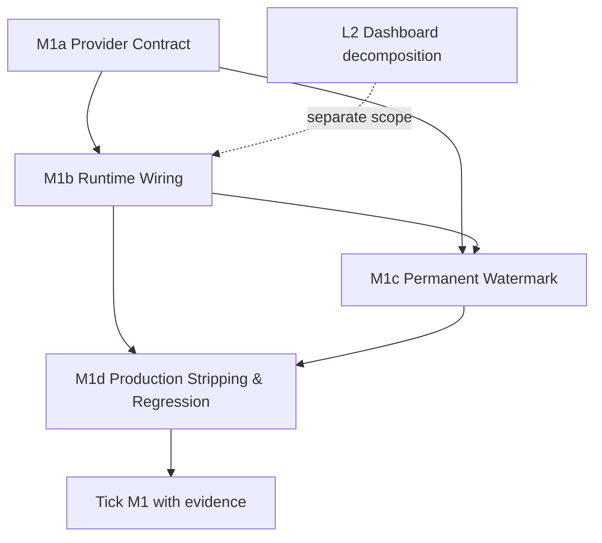

# Playbook فاز ۱۰: M1 — SAMPLE Data Separation

> **وضعیت:** فازبندی شده · **دامنه:** تحلیل ایستا و برنامه‌ریزی · **اجرا:** شروع نشده
>
> این سند فقط برنامه‌ی اجراست. هیچ build، test، migration یا تغییر در `apps/web/src/` در زمان تهیه‌ی آن انجام نشده است.

## Context

**M1** باقی‌مانده‌ی فاز ۱۰ است و هدف آن جدا کردن داده‌های نمایشی (`SAMPLE_*`) از provider واقعی داده‌های بالینی است. شرط نهایی M1 سه بخش دارد: داده‌ی نمونه باید از مسیر داده‌ی واقعی جدا باشد، هر نمایش نمونه باید banner یا watermark دائمی و غیرقابل‌ابهام داشته باشد، و payload/مسیر نمونه باید از production build حذف شود.

این موضوع در `docs/WEAKNESSES-V2-10-PHASES.md` به‌صورت زیر باز است: «SAMPLE data از provider واقعی جدا، banner/watermark دائمی داشته و در production build حذف شود.» در همان فایل، **L2** نیز باز است و dashboard بزرگ باید به component/hookهای کوچک‌تر شکسته شود. بنابراین M1 باید با مرزهای روشن اجرا شود: جداسازی provider می‌تواند مستقل آغاز شود، اما refactor گسترده‌ی dashboard نباید پیش‌شرط بستن M1 قرار گیرد.

در `DESIGN-V2.md`، بخش **§9.1** EntitlementService را تک‌منبع حقیقت server-side برای `{features[], quotas, usage}` تعریف می‌کند. بنابراین sample data نباید به‌عنوان fallback خاموش برای entitlement، بیمار، تصویر یا نتیجه‌ی تحلیل وارد مسیر production شود. بخش **§14.2** نیز gateهای CI را مشخص می‌کند: typecheck، lint، unit، integration، conformance، graph check، build و bundle budget. بخش **§18** جایگاه قابلیت‌های تصویر و تحلیل را در نقشه‌ی راه توضیح می‌دهد؛ داده‌ی نمونه باید فقط ابزار demo/development/test باشد و نباید با داده‌ی بالینی واقعی اشتباه شود.

ADR-0043 تصریح می‌کند که `ClinicalDashboard.tsx` و `NeuralSegmentationOverlay.tsx` هنوز payloadهای `SAMPLE_*` را inline یا نزدیک به UI تعریف/مصرف می‌کنند و M1 با L2 ارتباط دارد. ADR-0044 نیز دو exception از نوع `production-mocks` برای M1 را ثبت‌شده باقی می‌داند و می‌گوید اگر fixture واقعی برای M1 لازم باشد، باید آگاهانه در `apps/web/public` یا test fixture directory قرار گیرد، نه اینکه از فایل‌های تصادفی یا assetهای حذف‌شده احیا شود.

## Call-site Analysis

### نتیجه‌ی جست‌وجو

جست‌وجوی ایستای زیر مبنای این جدول است:

```text
grep -rn --exclude-dir=node_modules --exclude='*.map' -E 'SAMPLE_[A-Z0-9_]+' apps/web/src/
```

| فایل و خط | استفاده‌ی `SAMPLE_*` | نوع | production-safe؟ | تحلیل و جایگاه پیشنهادی |
|---|---|---|---|---|
| `apps/web/src/data/dashboard-samples.ts:39` | تعریف `SAMPLE_PATIENTS` با شرط `import.meta.env.DEV` | provider/fixture | **جزئی و ناکافی** | DEV gate از ورود مقدارها به production جلوگیری می‌کند، اما نام‌گذاری و export عمومی هنوز قرارداد صریحی برای عدم استفاده در مسیر واقعی ایجاد نمی‌کند. این فایل باید به provider نمونه‌ی صریح و test fixtureهای قابل کنترل تفکیک شود. |
| `apps/web/src/data/dashboard-samples.ts:84` | تعریف `SAMPLE_IMAGES` با شرط `import.meta.env.DEV` | provider/fixture | **جزئی و ناکافی** | همان مسئله‌ی `SAMPLE_PATIENTS` را دارد. assetهای تصویری، metadata و lifecycle آن باید از داده‌ی واقعی جدا و در مسیر demo/test کنترل شود. |
| `apps/web/src/components/ClinicalDashboard.tsx:38–39` | import کردن `SAMPLE_PATIENTS` و `SAMPLE_IMAGES` | runtime consumer | **ریسک‌دار** | dashboard مستقیماً provider نمونه را می‌شناسد و از abstraction مربوط به منبع داده عبور می‌کند. این call-site باید به provider/adapter تزریق‌شده یا حالت demo محدود منتقل شود. |
| `apps/web/src/components/ClinicalDashboard.tsx:139–140` | کامنتی که به DEV-gated بودن `SAMPLE_PATIENTS` و crash احتمالی production اشاره می‌کند | safety comment | **هشدار، نه enforcement** | کامنت نشان می‌دهد production behavior قبلاً مسئله‌دار بوده است. کامنت جایگزین invariant، test و gate نیست. invariant باید روی `null`/empty state و عدم انتخاب خودکار بیمار واقعی تعریف شود. |
| `apps/web/src/components/ClinicalDashboard.tsx:149` | مقداردهی `localPatients` با `SAMPLE_PATIENTS` | runtime state initialization | **ریسک‌دار** | state محلی با داده‌ی نمونه آغاز می‌شود. باید به explicit demo provider یا state خالی/داده‌ی API متصل شود؛ production نباید با fixture boot شود. |
| `apps/web/src/components/ClinicalDashboard.tsx:150` | مقداردهی `localImages` با `SAMPLE_IMAGES` | runtime state initialization | **ریسک‌دار** | همان مسیر برای تصاویر. initialization باید بر اساس provider انتخاب‌شده انجام شود و نبود داده‌ی واقعی باید empty state معتبر داشته باشد. |
| `apps/web/src/components/NeuralSegmentationOverlay.tsx:26` | تعریف inline `SAMPLE_DETECTIONS` با هشت detection | UI fixture/model-output fixture | **ناایمن از نظر provenance** | این داده به شکل خروجی تحلیل دیده می‌شود و در خود component قرار دارد. باید از fixture/demo adapter جدا شود و UI در production فقط detection واقعی یا empty state را بگیرد. |
| `apps/web/src/components/NeuralSegmentationOverlay.tsx:150` | `SAMPLE_DETECTIONS.map(...)` برای markerهای overlay | runtime consumer | **ریسک‌دار** | markerهای نمونه مستقیماً در render استفاده می‌شوند. render باید `detections` را از props یا analysis result بگیرد؛ demo mode باید منبع مستقل داشته باشد. |
| `apps/web/src/components/NeuralSegmentationOverlay.tsx:214` | نمایش `SAMPLE_DETECTIONS.length` در telemetry bar | runtime consumer/derived metric | **ریسک‌دار** | شمارش ثابتِ fixture به کاربر به‌صورت telemetry تحلیل نمایش داده می‌شود. count باید از detectionهای ورودی واقعی محاسبه شود و در demo با watermark همراه باشد. |
| `apps/web/src/components/__tests__/PatientListSection.spec.tsx:5,10,25,46,61,79,100` | import و مصرف `SAMPLE_PATIENTS`، از جمله `SAMPLE_PATIENTS[0]` | unit/component test fixture | **قابل‌قبول پس از انتقال** | این مصرف test-only است، اما بهتر است به factory/fixture نام‌گذاری‌شده منتقل شود تا grep production و grep test از هم قابل تشخیص باشند. |
| `apps/web/src/components/__tests__/PatientListSection.en.spec.tsx:5,20` | import و مصرف `SAMPLE_PATIENTS[0]` | localized component test fixture | **قابل‌قبول پس از انتقال** | باید به همان fixture contract مشترک وصل شود و به provider runtime وابسته نباشد. |
| `apps/web/src/__tests__/m5-blockers.spec.ts:26` | assert کردن نبودن الگوی `SAMPLE_PATIENTS[0]!` در source dashboard | regression guard | **مفید اما محدود** | این guard یک anti-pattern مشخص را می‌گیرد، ولی جداسازی کامل provider، watermark و حذف از production را اثبات نمی‌کند. باید در M1d با assertions صریح‌تر تکمیل شود. |

### Observations

سه دسته‌ی مصرف وجود دارد: **تعریف provider** در `dashboard-samples.ts`، **مصرف runtime** در dashboard و overlay، و **مصرف test-only** در تست‌های `PatientListSection`. نام `SAMPLE_*` به‌تنهایی مرز امنیتی یا production-safety نیست. شرط `import.meta.env.DEV` یک دفاع build-time اولیه است، اما برای پذیرش M1 باید با import-graph check، تست نبودن sample symbol در production artifact، و UI watermark تکمیل شود.

`NeuralSegmentationOverlay` علاوه بر markerها، count مشتق‌شده و telemetry را نیز از fixture می‌گیرد. حذف صرفاً constant بدون اصلاح این دو call-site باعث می‌شود UI همچنان ادعای خروجی تحلیل داشته باشد. در dashboard نیز مقداردهی اولیه‌ی state باید empty state و provider واقعی را به‌طور صریح پشتیبانی کند.

پیکربندی `apps/web/vite.config.ts`، `build.manifest: true` را فعال کرده است. این موضوع امکان verification روی manifest و static import graph را فراهم می‌کند. `tools/bundle-budget.ts` گزارش موجود را از manifest می‌خواند، initial payload را از lazy chunk جدا می‌کند و در صورت وجود policy، آن را enforce می‌کند. این ابزار اندازه‌گیری bundle است؛ به‌تنهایی ثابت نمی‌کند که sample symbol یا sample asset در artifact وجود ندارد. M1 باید gate مستقلی برای این invariant داشته باشد و نتیجه را به bundle gate متصل کند.

## Proposed Phase Split

| Phase | عنوان | دامنه‌ی تغییر | Dependency | Rollback point | CI gates |
|---|---|---|---|---|---|
| **M1a** | Sample Data Provider Contract | استخراج `dashboard-samples.ts` به provider/factory و fixtureهای test-only؛ تعریف empty state و قرارداد منبع داده؛ حذف import مستقیم sample از مرزهای runtime تا حد ممکن | — | **بله**؛ بعد از ایجاد provider و تست‌های contract | typecheck، lint، unit، conformance |
| **M1b** | Runtime Wiring و Provenance | اتصال `ClinicalDashboard` و `NeuralSegmentationOverlay` به props/adapter واقعی؛ انتقال `SAMPLE_DETECTIONS` به demo/test provider؛ جلوگیری از مقداردهی sample در production state | M1a | **بله**؛ بعد از سبز شدن مسیر واقعی و demo | typecheck، unit، component، conformance |
| **M1c** | Permanent Demo Watermark | افزودن banner/watermark دائمی برای هر حالت demo/sample، شامل overlay و dashboard؛ تعریف copy ثابت و تست مشاهده‌پذیری آن | M1a، M1b | **بله**؛ پس از اثبات حضور watermark در هر demo route | unit، component، conformance، build |
| **M1d** | Production Stripping و Regression Gate | تضمین حذف sample code/data/assets از production graph؛ بررسی manifest و artifact؛ حفظ fixtureهای test-only؛ تکمیل regression suite و مستند evidence | M1a، M1b، M1c | **بله، اما حساس**؛ قبل از tick کردن M1 یک rollback point نهایی | build، bundle-budget، production-stripping، regression، CI evidence |

### Scope boundary با L2

M1a و M1b باید فقط تغییرات لازم برای provider boundary و wiring را انجام دهند. شکستن کامل `ClinicalDashboard.tsx` به component/hookهای کوچک‌تر، سیستم style استاندارد و هر تغییر معماری گسترده در L2 باقی می‌ماند. اگر در M1 نیاز به جابه‌جایی کد وجود داشت، باید کمینه، reversible و با test evidence باشد.

## Acceptance Criteria per Phase

### M1a — Sample Data Provider Contract

**Criteria**

1. یک قرارداد صریح برای منبع داده تعریف شده است که بین `real`، `demo` و `test` تمایز دارد.
2. fixtureهای patient، image و detection در مسیر test/demo قابل شناسایی قرار دارند و import مستقیم آن‌ها از production runtime حذف یا به یک demo-only boundary محدود شده است.
3. provider واقعی در نبود داده، empty state معتبر برمی‌گرداند و برای render به `SAMPLE_*[0]` یا non-null assertion وابسته نیست.
4. fixtureهای موجود در تست‌های `PatientListSection` بدون وابستگی به state dashboard قابل استفاده‌اند.
5. هیچ تغییر ناخواسته‌ای در `apps/web/src` خارج از دامنه‌ی provider wiring وارد نشده است.

**Future test commands — not run during planning**

```bash
npm exec vitest run apps/web/src/components/__tests__/PatientListSection.spec.tsx apps/web/src/components/__tests__/PatientListSection.en.spec.tsx
npm exec tsc -p apps/web/tsconfig.json --noEmit
npm exec eslint apps/web/src/data apps/web/src/components/ClinicalDashboard.tsx apps/web/src/components/NeuralSegmentationOverlay.tsx
```

**Verification**

بازبینی import graph باید نشان دهد test fixtureها فقط از test/demo boundary وارد می‌شوند. typecheck باید نبودن mismatch در `Patient`، `TrichoscopyImage` و `FollicleDetection` را ثابت کند. تست component باید هم fixture موجود و هم empty state را پوشش دهد.

### M1b — Runtime Wiring و Provenance

**Criteria**

1. `ClinicalDashboard` داده‌ی sample را به‌صورت implicit در production state initialize نمی‌کند.
2. `NeuralSegmentationOverlay` detection را از input/adapter می‌گیرد و `map` و count هر دو از همان input مشتق می‌شوند.
3. production path هیچ خروجی sample را به‌عنوان analysis result، patient record یا telemetry واقعی معرفی نمی‌کند.
4. حالت demo همچنان برای توسعه و manual review قابل اجراست و منبع آن با provider واقعی قابل اشتباه نیست.
5. provenance برای داده‌ی نمایش‌داده‌شده قابل تشخیص است؛ دست‌کم `mode: demo|real|test` یا قرارداد معادل آن باید در boundary موجود باشد.

**Future test commands — not run during planning**

```bash
npm exec vitest run apps/web/src/__tests__/m5-blockers.spec.ts
npm exec vitest run apps/web/src/components
npm exec tsc -p apps/web/tsconfig.json --noEmit
```

**Verification**

تست باید dashboard را با provider واقعی mock شده و با provider demo جداگانه mount کند. برای overlay باید detection ورودی خالی و detection واقعی/fixture بررسی شود. در هر دو حالت، خروجی باید از input مشتق شود و نه از constant داخلی component.

### M1c — Permanent Demo Watermark

**Criteria**

1. هر dashboard یا overlay که با mode demo/sample render می‌شود، watermark دائمی و قابل‌مشاهده دارد.
2. watermark فقط tooltip، hover، console message یا متن قابل حذف با یک interaction نیست.
3. watermark شامل معنای صریح «Demo / Sample data — not clinical data» یا متن معادل localized است.
4. watermark در viewportهای desktop و mobile، روی تصویر و کنار داده‌ی تحلیلی، قابل مشاهده باقی می‌ماند.
5. مسیر real mode watermark demo را نمایش نمی‌دهد.

**Future test commands — not run during planning**

```bash
npm exec vitest run apps/web/src/components --testNamePattern='demo|watermark|sample'
npm exec tsc -p apps/web/tsconfig.json --noEmit
npm exec eslint apps/web/src/components
```

**Verification**

تست component باید وجود watermark را در حالت demo و نبود آن را در حالت real assert کند. verification بصری باید overlay، dashboard، responsive layout و contrast متن را پوشش دهد. اگر screenshot test در repository موجود نیست، CI باید دست‌کم assertion DOM و کلاس/attribute پایدار watermark را اجرا کند.

### M1d — Production Stripping و Regression Gate

**Criteria**

1. production build بدون import، symbol، fixture payload و sample assetهای M1 تولید می‌شود.
2. manifest تولیدشده با `build.manifest: true` بررسی می‌شود و هیچ مسیر production به sample provider متصل نیست.
3. یک gate fail-closed وجود دارد که در صورت حضور `SAMPLE_PATIENTS`، `SAMPLE_IMAGES`، `SAMPLE_DETECTIONS` یا fixture asset در production artifact، CI را قرمز می‌کند.
4. bundle-budget از گزارش واقعی initial payload استفاده می‌کند و report به‌عنوان artifact نگهداری می‌شود؛ report به main commit نمی‌شود.
5. test-only fixtureها همچنان قابل اجرا هستند و stripping آن‌ها را به‌اشتباه حذف نمی‌کند.
6. فقط پس از داشتن regression، CI evidence و گزارش completion، ردیف M1 در weakness document tick می‌شود.

**Future test commands — not run during planning**

```bash
npm run build --workspace apps/web
node --import tsx tools/bundle-budget.ts --policy tools/bundle-budget.policy.json
npm exec vitest run tools/quality apps/web/src/__tests__
```

`npm run build` و سایر commandهای این بخش فقط commandهای پیشنهادی برای اجرای آینده‌اند و در تهیه‌ی این سند اجرا نشده‌اند. مسیر دقیق policy و script باید با manifest repository در PR پیاده‌سازی نهایی تطبیق داده شود؛ اگر script wrapper موجود است، همان wrapper canonical خواهد بود.

**Verification**

پس از build، manifest و فایل‌های initial payload با یک scanner deterministic بررسی می‌شوند. scanner باید نام‌های sample، مسیر provider و fingerprintهای fixture را جست‌وجو کند و در صورت match، با exit code غیرصفر خارج شود. سپس `tools/bundle-budget.ts` باید همان manifest را برای سقف bundle بررسی کند. نتیجه‌ی CI باید شامل command، commit SHA، report path، scanner result و artifact link باشد.

## Dependency Graph



L2 یک dependency اجرایی سخت برای M1 نیست. فقط در صورتی باید به M1 وارد شود که wiring بدون جابه‌جایی محدود در dashboard ممکن نباشد؛ در آن حالت scope و rollback باید در PR صریح ثبت شود.

## Estimated Effort

برآورد زیر برای یک engineer آشنا با repository، بدون احتساب زمان review یا اصلاحات ناشی از CI است.

| Subtopic | Estimate | Main uncertainty |
|---|---:|---|
| M1a — provider contract، factory و fixture boundary | 4–6 ساعت | میزان coupling فعلی typeها و importهای غیرمستقیم |
| M1b — dashboard/overlay runtime wiring و provenance | 6–10 ساعت | مقدار refactor لازم در state initialization و API adapter |
| M1c — watermark component، localization و responsive verification | 3–5 ساعت | تعداد demo surfaces و نیاز به visual regression |
| M1d — production scanner، manifest verification و regression gate | 6–10 ساعت | شکل نهایی build artifact و محل fixture assetها |
| Review، CI evidence و completion report | 2–4 ساعت | زمان اجرای pipeline و تعداد roundهای review |
| **جمع** | **21–35 ساعت** | بدون اجرای migration یا تغییرات L2 |

## Rollback Strategy and Points

**M1a rollback point:** پس از commit provider contract و fixture tests، پیش از wiring runtime. اگر type یا test contract ناسازگار باشد، فقط provider/fixture changes برگردانده می‌شود.

**M1b rollback point:** پس از اتصال هر دو consumer اصلی و سبز شدن component tests. اگر real data path یا empty state regression داشته باشد، wiring به adapter قبلی برمی‌گردد؛ fixtureها نباید به runtime برگردند مگر با flag صریح demo.

**M1c rollback point:** پس از اضافه شدن watermark و تست mode separation. اگر layout یا accessibility مشکل داشته باشد، خود watermark component revert می‌شود و M1b حفظ می‌گردد.

**M1d rollback point:** پیش از tick کردن weakness و merge نهایی. scanner و CI gate باید ابتدا در حالت report-only در branch بررسی شوند، سپس fail-closed شوند. در صورت false positive، rule نباید حذف یا exception دائمی شود؛ مسیر fixture باید اصلاح یا با ADR مستند و موقتاً محدود شود.

هیچ rollback نباید sample data را به production provider برگرداند. rollback فقط باید آخرین لایه‌ی تغییرکرده را برگرداند و empty state/real provider را نگه دارد.

## CI Impact

| Phase | Gateهای touch‌شده | تغییر مورد انتظار در CI | Artifact/evidence |
|---|---|---|---|
| M1a | typecheck، lint، unit، conformance | بررسی import boundary، type contract و fixture ownership | test log، typecheck log، conformance report |
| M1b | typecheck، unit/component، conformance | جلوگیری از sample initialization و اطمینان از provenance و empty state | component report و import-boundary evidence |
| M1c | unit/component، conformance، build | assertion برای حضور watermark در demo و نبود آن در real | test report و در صورت وجود screenshot artifact |
| M1d | build، manifest scan، bundle-budget، regression، CI evidence | build واقعی با manifest، scanner fail-closed، enforce policy و نگهداری report به‌عنوان artifact | manifest، stripping report، bundle report، regression log |

بر اساس §14.2، M1 نباید gateهای migration، Postgres integration یا RLS را تغییر دهد؛ آن gateها فقط باید به‌سبب تغییرات غیرمرتبط سبز باقی بمانند. تغییر اصلی M1 در زنجیره‌ی `build + bundle-budget` و gateهای conformance/regression است. گزارش‌ها artifact هستند و نباید به `main` commit شوند.

## Completion Checklist

- [ ] M1a contract و fixture boundary با tests ثبت شده است.
- [ ] M1b runtime consumers از sample constants مستقل شده‌اند.
- [ ] M1c watermark دائمی در همه‌ی demo surfaces assert شده است.
- [ ] M1d production artifact با manifest scanner بررسی شده است.
- [ ] bundle-budget report و stripping report در CI artifact موجود است.
- [ ] هیچ exception جدیدی برای پنهان کردن finding ثبت نشده است.
- [ ] M1 در `docs/WEAKNESSES-V2-10-PHASES.md` فقط پس از evidence کامل tick شده است.
- [ ] completion report شامل PR/commit، regression، CI/conformance و نتیجه‌ی gate است.

## References

[1]: `../DESIGN-V2.md` "ScalpAI Design V2 — sections 9.1, 14.2 and 18"
[2]: `../WEAKNESSES-V2-10-PHASES.md` "Phase 10 weaknesses and M1 entry"
[3]: `../adr/ADR-0043-phase10-product-quality.md` "ADR-0043 — Phase 10 product quality batch 1"
[4]: `../adr/ADR-0044-phase10-debt-removal.md` "ADR-0044 — Phase 10 debt removal batch 2"
[5]: `../../apps/web/src/components/ClinicalDashboard.tsx` "ClinicalDashboard sample-data call sites"
[6]: `../../apps/web/src/components/NeuralSegmentationOverlay.tsx` "Neural segmentation sample detections"
[7]: `../../apps/web/vite.config.ts` "Vite build manifest configuration"
[8]: `../../tools/bundle-budget.ts` "Bundle budget measurement and policy enforcement"
